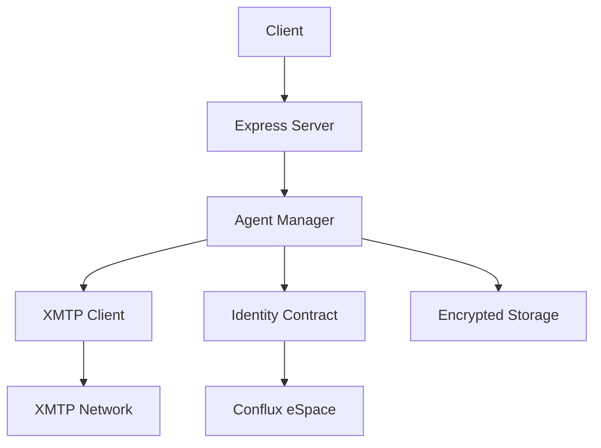

# MCP XMTP Server

A TypeScript implementation of the MCP (Multi-Agent Communication Protocol) server using XMTP for decentralized messaging.

## Features

- **Agent Registration**: Register agents with recall IDs and cryptographic identities
- **XMTP Integration**: Send and receive messages through XMTP protocol
- **Identity Management**: On-chain identity registry using Conflux eSpace
- **Group Messaging**: Create and manage group conversations
- **Secure Storage**: Encrypted agent data storage

## Architecture



## API Endpoints

### Agent Management
- `POST /register_id` - Register a new agent (returns `agent_id`)
- `POST /recall_id` - Recall an existing agent by `agent_id`
- `POST /go_online` - Bring an agent online
- `GET /collect_identities` - Get all registered identities
- `GET /agent/status/:agent_id` - Check agent status

### XMTP Messaging
- `POST /xmtp/send` - Send a message
- `GET /xmtp/messages` - Get messages
- `GET /xmtp/conversations` - Get conversations
- `POST /xmtp/groups/create` - Create a group

### Health Check
- `GET /health` - Server health status

## Installation

1. Clone the repository
2. Install dependencies:
   ```bash
   npm install
   ```

3. Copy environment variables:
   ```bash
   cp .env.example .env
   ```

4. Configure your environment variables in `.env`

5. Build the project:
   ```bash
   npm run build
   ```

6. Start the server:
   ```bash
   npm run dev   # ts-node src/server.ts
   # or
   npm start     # node dist/server.js (after build)
   ```

## Development

Run in development mode with hot reload:
```bash
npm run dev
```

## Docker

Run via Docker Compose (recommended full stack):
```bash
docker compose up -d
# XMTP server health: http://localhost:58548/health
```

## Environment Variables

- `PORT`: Server port (default: 58548)
- `NODE_ENV`: Environment (development/production)
- `XMTP_ENV`: XMTP environment (dev recommended)
- `CONFLUX_RPC_URL`: Conflux eSpace RPC URL
- `IDENTITY_CONTRACT_ADDRESS_FILE`: Path to deployed address file (e.g., `/hardhat/contract_address.txt`)
- `IDENTITY_CONTRACT_ABI_PATH`: Path to IdentityRegistry ABI JSON
- `DEFAULT_ESPACE_PRIVATE_KEY`: Private key for eSpace operations
- `SERVER_URL`: Base URL for MCP adapter/CLI (default `http://localhost:58548`)
- `AGENTMESSAGE_MEMORY_PATH`: Path to store `ethereum_address.json` for MCP adapter

## Key Functions

### register_id / recall_id
Register a new agent (returns `agent_id`) or recall an existing one. The MCP adapter persists `agent_id` to `AGENTMESSAGE_MEMORY_PATH/ethereum_address.json` for subsequent tool calls.

### collect_identities
Retrieves all registered identities from the on-chain registry.

## Security

- Agent private keys are encrypted using AES-256-GCM
- Password-based key derivation using scrypt
- Secure random key generation
- XMTP end-to-end encryption for messages

## MCP Adapter

- Start stdio MCP adapter: `npm run mcp`
- Tools automatically read `agent_id` from `AGENTMESSAGE_MEMORY_PATH/ethereum_address.json`
- Use the `register_recall_id` tool once; it calls `/register_id` or `/recall_id` and saves `agent_id`